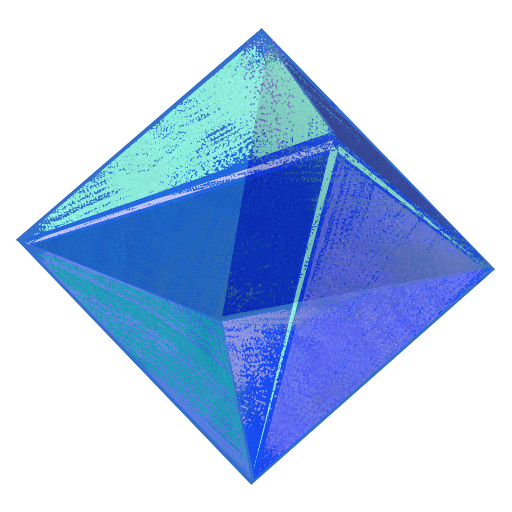

# <a href="https://ramiels.me/"> ramiels.me </a>

Hey :) I write text, usually for computers. 
[hey@ramiels.me](mailto:hey@ramiels.me)&emsp;\\\\&emsp;[GPG](https://github.com/wiki-Bird.gpg)&emsp;\\\\&emsp;

### `>`&emsp;Current personal projects

- 🔵 [BlueScreen](https://github.com/wiki-Bird/bluescreen), a Twitter Blue tweet/ad blocker
- 😺 [Meowd](https://meowd.ramiels.me/), a powerful Discord moderation bot
- 🔗 [Zeruel](https://github.com/wiki-Bird/Zeruel), a QR-Code creator & link minifier
<!-- - ⌨️ [Keybored](https://keybored.ramiels.me/), a web based typing game -->

### `>`&emsp;Contributor to
- [YASB](https://github.com/denBot/yasb), a highly configurable cross-platform status bar
- [250kb-club](https://github.com/nkoehring/250kb-club), a club for web pages weighing no more than 250kb
- [MDN Web Docs](https://github.com/mdn/content), detailed docuemntation for JS, HTML/CSS, and more
- [Serato DJ/Studio](https://serato.com/), music production and DJ software
- [Ente Auth](https://github.com/ente-io/ente), an open source 2FA authenticator

<!-- To add: -->
<!-- ### `>`&emsp;Latest posts
- []
- [Induced demand on the Information Superhighway](https://ramiels.me/blog/webBloat) -->

<!-- To remove: -->
### `>`&emsp;I like to make stuff with

&emsp;&emsp;

 

<!--  -->
&emsp;&emsp;&emsp;&emsp;&nbsp;&thinsp;

